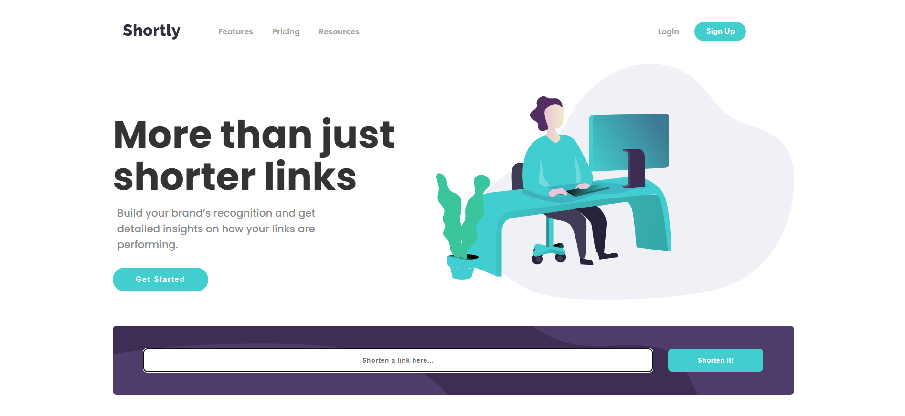
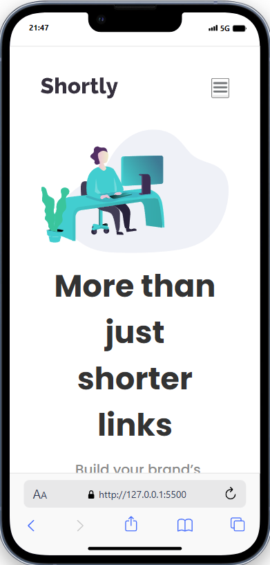

# Frontend Mentor - Advice generator app solution

This is a solution to the [Advice generator app challenge on Frontend Mentor](https://www.frontendmentor.io/challenges/advice-generator-app-QdUG-13db).

## Table of contents

- [Overview](#overview)
  - [The challenge](#the-challenge)
  - [Screenshot](#screenshot)
  - [Links](#links)
- [My process](#my-process)
  - [Built with](#built-with)
  - [What I learned](#what-i-learned)
- [Author](#author)

## Overview

### The challenge

Users should be able to:

- View the optimal layout for the app depending on their device's screen size
- See hover states for all interactive elements on the page
- Generate a new piece of advice by clicking the dice icon

### Screenshot




### Links

- Solution URL: [https://github.com/rugarcia25/advice-generator-app-main](https://github.com/rugarcia25/advice-generator-app-main)
- Live Site URL: [https://rugarcia25.github.io/advice-generator-app-main/](https://rugarcia25.github.io/advice-generator-app-main/)

## My process

### Built with

- Semantic HTML5 markup
- CSS custom properties
- Flexbox
- JavaScript
- API

### What I learned

Making requests to API

```js
const getAdvice = () => {
  fetch("https://api.adviceslip.com/advice")
    .then((response) => response.json())
    .then((data) => {
      id.innerHTML = data.slip.id;
      quote.innerHTML = "''" + data.slip.advice + "''";
    })
    .catch((err) => {
      quote.innerHTML = err.message;
    });
};
```

## Author

- Website - [Rubén Garcia](https://rgdev.netlify.app/)
- Frontend Mentor - [@rugarcia25](https://www.frontendmentor.io/profile/rugarcia25)
- Github - [@rugarcia25](https://github.com/rugarcia25)